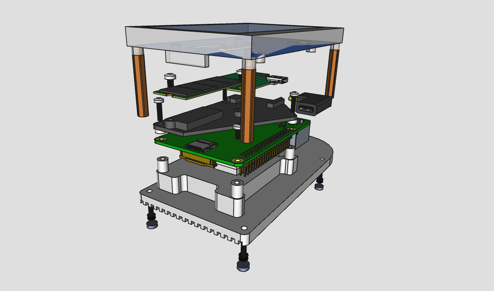
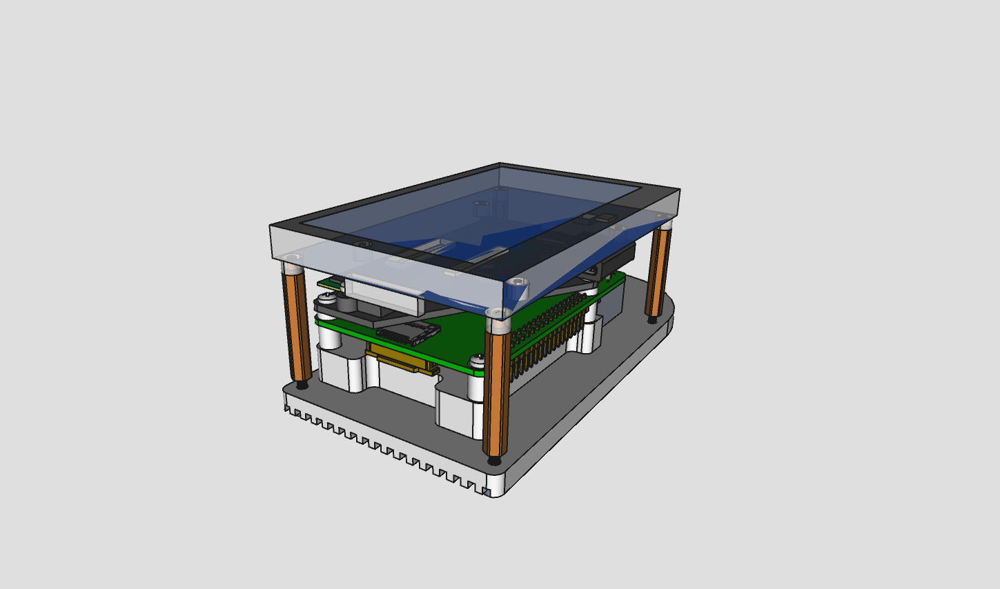
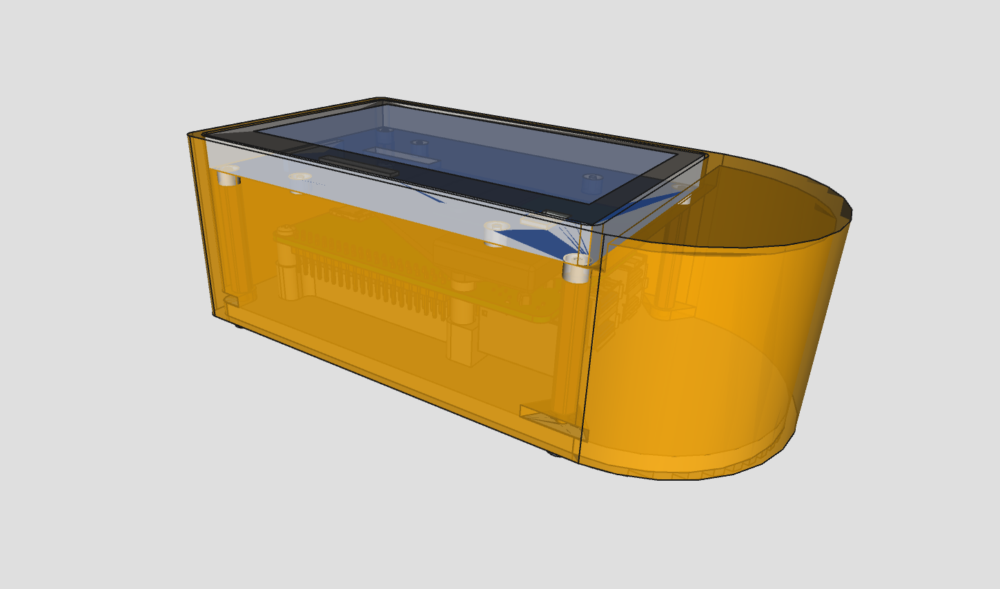

# nakamochi 3D designs

the repo contains 3D models of parts used in the nakamochi project.

those design sources which are made with [freecad](https://freecad.org/)
use a version no older than v0.20. a stock installation of freecad should
be sufficient but you might want to install
[fasteners workbench](https://wiki.freecadweb.org/Fasteners_Workbench) if working on
a design assembly.

there are currently designs only for the [NERD edition](https://nakamochi.io/#nerd).
KAFI version is coming later on. generated files like STL, STEP and DXF are attached
to their respective releases on https://git.qcode.ch/nakamochi/3d/releases

## NERD edition

this version features a custom heatsink combined with the bottom plate, suitable
for aluminium CNC milling. the construction provides a good heat dissipation,
making an active cooling like a fan redundant.

|    |    |
| ---|--- |
|  |  |
|                          |  |

the baseplate serving as a heatsink brings down the main CPU temperature
from around 70℃  to 50℃. when measured externally while doing bitcoin initial
blocks download, an IR camera showed around 36℃.

the main file [nerd.FCStd](nerd/nerd.FCStd) contains all parts
as well as the assembly. a complete assembly BOM is as follows.

**off the shelf parts**

- [raspberry pi 4 model b][rpi4]
- [waveshare 4.3inch DSI LCD][lcd]
- [sandisk portable 1TB SSD sdssde30-1t00][ssd]
- 90 degree angle [USB-C adapter][usbc90deg] 3.1 gen 2, 10Gbps
- adhesive gasket/seal tape for LCD, 1mm thick, 10mm width, L370mm
- 3 thermal pads 1.5mm thick, 424mm sq total area - see baseplate drawing
- 7 screws M2.5 L10mm
- 4 adhesive bottom pads Ø5mm, 3mm+ thick

[rpi4]: https://www.raspberrypi.com/products/raspberry-pi-4-model-b/
[lcd]: https://www.waveshare.com/wiki/4.3inch_DSI_LCD
[ssd]: https://www.westerndigital.com/en-in/products/portable-drives/sandisk-usb-3-2-ssd
[usbc90deg]: https://www.delock.de/produkt/65915/merkmale.html

other parts, harvested from the above list:

- 2 self-tapping screws 2.9mm L3mm (from the SSD)
- 1 screw M2.5 L5mm (from the LCD)
- 4 PCB standoffs M2.5 L30mm (from the LCD)

**custom parts**

- CNC milled aluminium baseplate (look for `baseplate_techdraw_c.pdf` in releases)
- 3D-printed enclosure box (look for `box.stl` in releases)
- 3D-printed SSD support plate (look for `ssdsupport.stl` in releases)
- 3 Ø3mm hole 2.4mm thick spacers (use `spacer_3x2.4mm.stl` for 3D-print)

> TODO: assembly instructions

## assets

various files are placed in the [assets](assets/) to use in an assembly composition.
for example, you'll find a 4.3inch display, raspberry pi 4 and a heatsink in there.

when creating a design assembly, make a new [std part](https://wiki.freecad.org/Std_Part)
group and import desired assets into it. if an asset is in a freecad file format,
open the file and drag&drop the top level object into the newly created std part.
then close the original file ignoring the changes.

## license

[CC-BY 4.0](https://creativecommons.org/licenses/by/4.0/)
