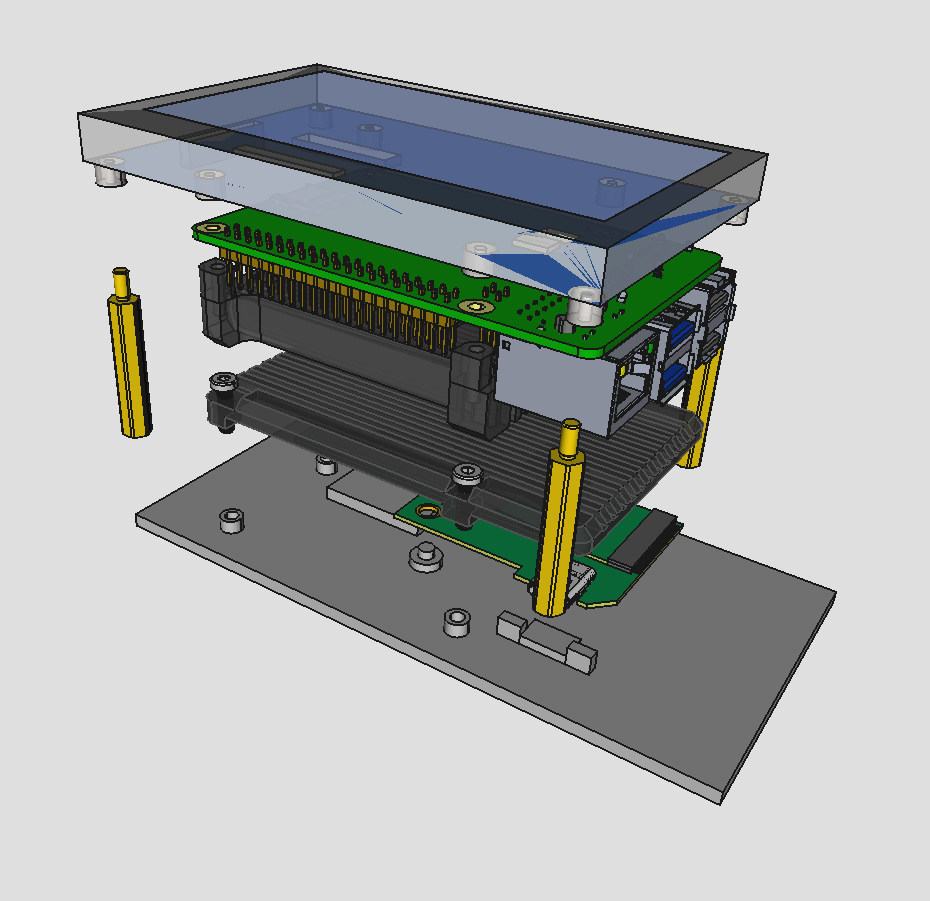
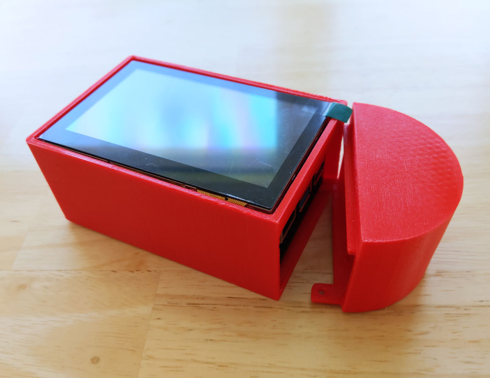
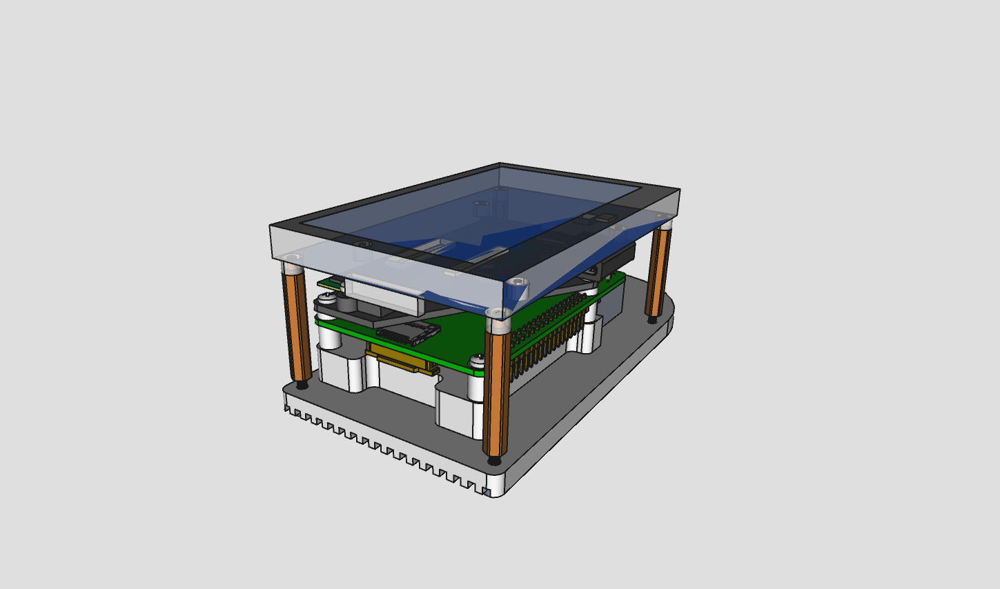
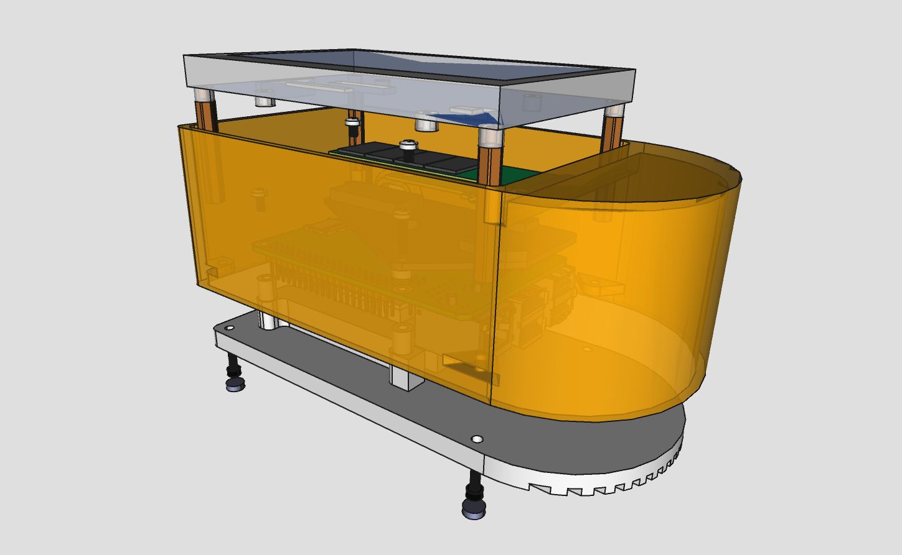
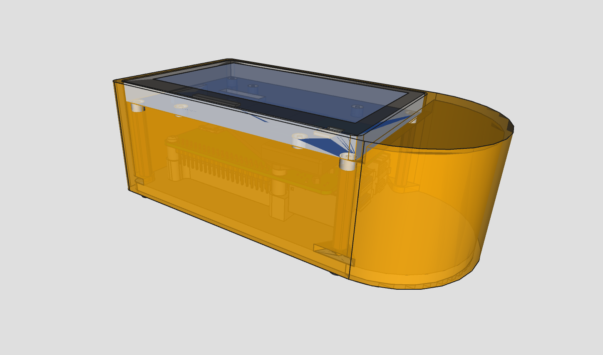
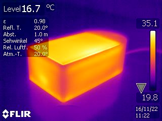

# nakamochi 3D designs

the repo contains 3D models of parts used in the nakamochi project.

those design sources which are made with [freecad](https://freecad.org/)
use a version no older than v0.20. a stock installation of freecad should
be sufficient but you might want to install
[fasteners workbench](https://wiki.freecadweb.org/Fasteners_Workbench) if working on
a design assembly.

## DIY version (FFF)

fused filament fabrication design is suitable for 3D printing at home, located
in the [fff](fff/) directory. the main file is in [fff/provcase.FCStd](fff/provcase.FCStd).
"provcase" stands for "provisional case" because it was unclear at the time whether
this would have been the final version.

the project contains all the parts to make a full assembly with the following BOM:

- [raspberry pi 4 model b][rpi4]
- [waveshare 4.3inch DSI LCD][lcd]
- [sandisk portable 1TB SSD sdssde30-1t00][ssd]
- [joi-it armor "block" heatsink](https://joy-it.net/en/products/RB-AlucaseP4+07)
- 90 degree angle [USB-C adapter][usbc90deg] 3.1 gen 2, 10Gbps
- adhesive gasket/seal tape for LCD, 1mm thick, 10mm width, L370mm
- 4 screws M2.5 L16-18mm for heatsink mount
- 4 spacers 2-4mm thick depending on the heatsink mount screws length
- 4 adhesive bottom pads
- [enclosure main box](fff/box.stl), 3D-printed
- [enclosure side cup](fff/sidecup.stl), 3D-printed

all object constraints reference an embedded spreadsheet `params` to avoid 
[topological naming problem](https://wiki.freecadweb.org/Topological_naming_problem).
prefer constraining against datum objects instead of faces and other elements produced
directly from sketches like pads.

finally, the [fff/provcase-assembly.FCStd](fff/provcase-assembly.FCStd) file contains
an "assembly" group. this is simply a collection of parts composed together to help
visualize how and whether all of them fit well together. it links to the provcase.FCStd,
so you'll need both files. this assembly group calculates all placement offsets from
`asmsheet` spreadsheet. here's how the assembly looks like:

   |
---|---
 | 

the "assembly" std part has a custom property "view" with two options: exploded and
assembled. the property is configured from the same asmsheet.

### 3D printing the parts

> TODO: insert here acceptable 3D printer specs and an assembly guide

## DIY+ (plus)

this version features a custom heatsink combined with the bottom plate, suitable
for aluminium CNC milling. the construction provides a better heat dissipation
compared to the DIY (FFF) version.

   |
---|---
 | 
 | 

the baseplate serving as a heatsink brings down the main CPU temperature
from around 70℃  to 50℃. when measured externally while doing bitcoin initial
blocks download, an IR camera showed around 36℃.

the main file [diyplus.FCStd](diyplus/diyplus.FCStd) contains all parts
as well as the assembly. other files in the [diyplus](diyplus/) directory are
exports from the main file, such as baseplate DXF, STL, STEP and drawings.

a complete assembly BOM is as follows.

**off the shelf parts**

- [raspberry pi 4 model b][rpi4]
- [waveshare 4.3inch DSI LCD][lcd]
- [sandisk portable 1TB SSD sdssde30-1t00][ssd]
- 90 degree angle [USB-C adapter][usbc90deg] 3.1 gen 2, 10Gbps
- adhesive gasket/seal tape for LCD, 1mm thick, 10mm width, L370mm
- 3 thermal pads 1.5mm thick, 424mm sq total area - see baseplate drawing
- 7 screws M2.5 L10mm
- 4 adhesive bottom pads Ø5mm, 3mm+ thick

[rpi4]: https://www.raspberrypi.com/products/raspberry-pi-4-model-b/
[lcd]: https://www.waveshare.com/wiki/4.3inch_DSI_LCD
[ssd]: https://www.westerndigital.com/en-in/products/portable-drives/sandisk-usb-3-2-ssd
[usbc90deg]: https://www.delock.de/produkt/65915/merkmale.html

other parts, harvested from the above list:

- 2 self-tapping screws 2.9mm L3mm (from the SSD)
- 1 screw M2.5 L5mm (from the LCD)
- 4 PCB standoffs M2.5 L30mm (from the LCD)

**custom parts**

- [baseplate](diyplus/baseplate_techdraw_c.pdf), CNC milled from aluminium
- [enclosure box](diyplus/box.stl), 3D-printed
- [SSD support plate](diyplus/ssdsupport.stl), 3D-printed
- 3 [spacers](diyplus/spacer_3x2.4mm.stl) Ø3mm hole, 2.4mm thick

> TODO: assembly instructions

## assets

various files are placed in the [assets](assets/) to use in an assembly composition.
for example, you'll find a 4.3inch display, raspberry pi 4 and a heatsink in there.

when creating a design assembly, make a new [std part](https://wiki.freecad.org/Std_Part)
group and import desired assets into it. if an asset is in a freecad file format,
open the file and drag&drop the top level object into the newly created std part.
then close the original file ignoring the changes.

## license

[CC-BY 4.0](https://creativecommons.org/licenses/by/4.0/)
